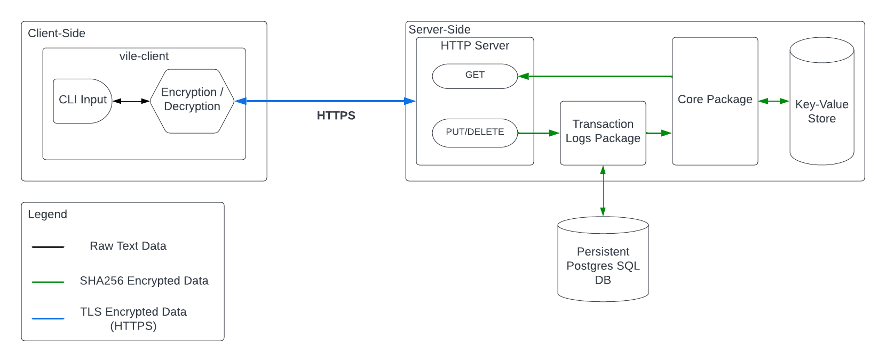

# vile

Monolithic Key-Value Store (cloud-native distributed architecture in progress)

- [vile](#vile)
  - [Distributed Architecture](#distributed-architecture)
  - [Monolithic Architecture](#monolithic-architecture)
    - [Overview](#overview)
    - [Features](#features)
      - [Client-side SHA256 Encryption](#client-side-sha256-encryption)
      - [Secure Access Via HTTPS/TLS](#secure-access-via-httpstls)


## Distributed Architecture

The distributed version of vile is currently in progress. Documentation to come soon

## Monolithic Architecture

### Overview



When used with the secure [vile-client](https://github.com/RohitKochhar/vile-client), Vile is a highly secure and reliable remote key value store featuring end-to-end encryption.

### Features

#### Client-side SHA256 Encryption

When used with [vile-client](https://github.com/RohitKochhar/vile-client), the `vile` key-value store provides end-to-end encryption. 

Client-side encryption done using a secret password created by the user ensures that even if the server was comprimised, the data would be unreadable without the private key used to hash the value.

By ensuring that raw data is encrypted and decrypted on the client side ensures that as long as the user's password is protected, their data is protected.

For example:

Suppose I have the following `~/.vile.yaml` configuration file:

```yaml
host: localhost
port: 8080
secretKey: vilepassword
```

If I use the [vile-client](https://github.com/RohitKochhar/vile-client) to write data to the remote store:

```bash
$ vile add album "watch my moves"
Using config file: /Users/rohitsingh/.vile.yaml
Successfully added album:"watch my moves" to remote vile store
```

Both the album and the key are encrypted using [SHA256 encryption](https://en.wikipedia.org/wiki/SHA-2), meaning that even if any component remote server were to be exposed, the key would be obsfuscated as a hash (i.e. `0000000000000000000ER09N8PTPJM448NT0ATP199Q9IPKQU3EG====`), and so would the value (i.e. `0000000000000000000D2FP5AHG7IV4GGTK96DFFIJ2VTVK1ASDG====`).

#### Secure Access Via HTTPS/TLS

The vile server uses the TLS protocol to ensure that data communicated to the server is encrypted, on top of the client-side encryption. This provides an additional layer of security and prevents mitigates remote communication vulnerabilities.
